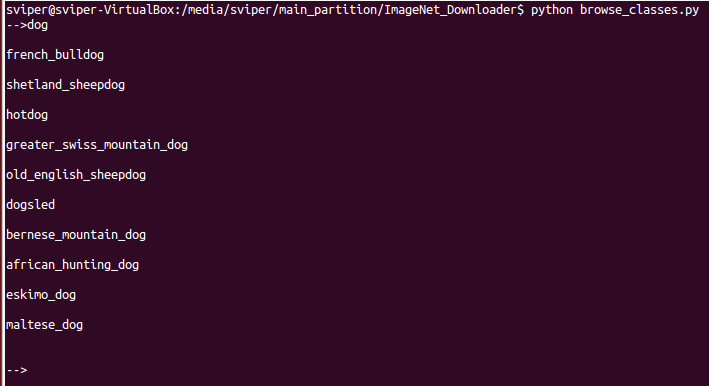

# ImageNet downloader

A simple utility to search and download images from ImageNet Fall 2011 release. 

### Why?
Because I do not have 60GB bandwidth. 

### How? 
1. Get the Fall 2011 Urls 
Run the script get_data.sh to download the ImageNet fall 2011 urls. (~335 MB)

2. Browse classes 
Use the script "python browse_classes.py" to find the correct class name for your query. 
For. e.g if you want images of dogs, searching for "dog" will get you the following list of 
dog related classes. 


3. Download images of particular class
Once you have figured out the EXACT class name, use "python download_images.py" to download the images. 
```sh
python download_images.py -c french_bulldog -n 10 -o ./downloads/
where
  -c The class whose images will be downloaded
  -n The number of images to be downloaded (with auto upper limit)
  -o output folder for downloaded images
```

### Acknowledgement
Thank you Francois Chollet for parsing ImageNet and creating imagenet_class_index.json 
